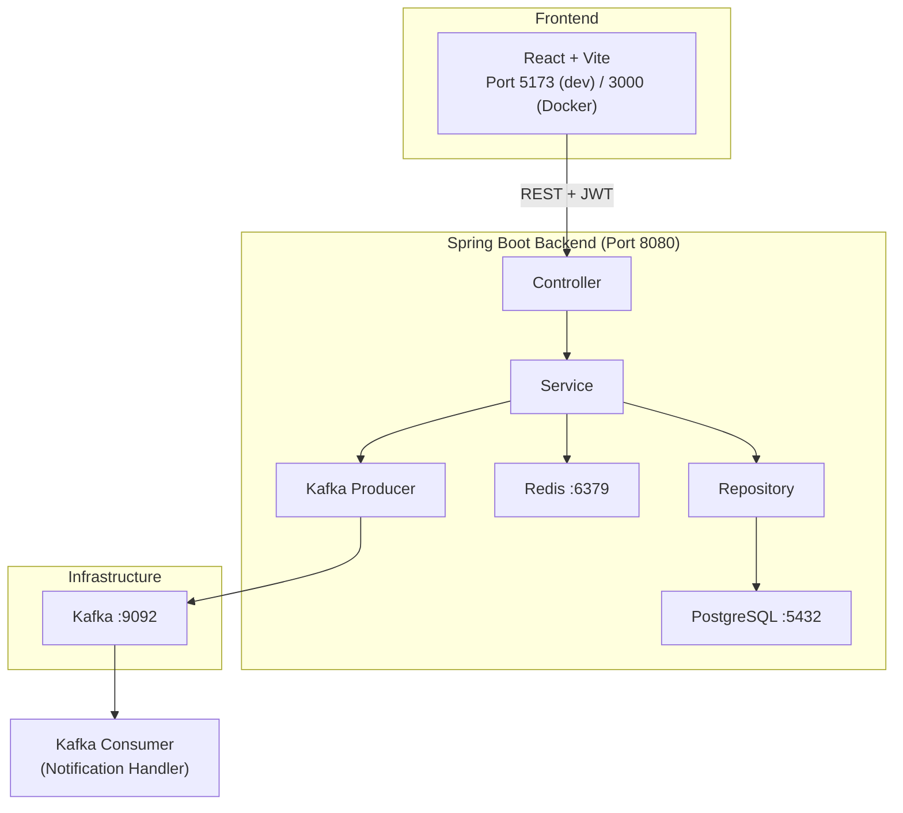
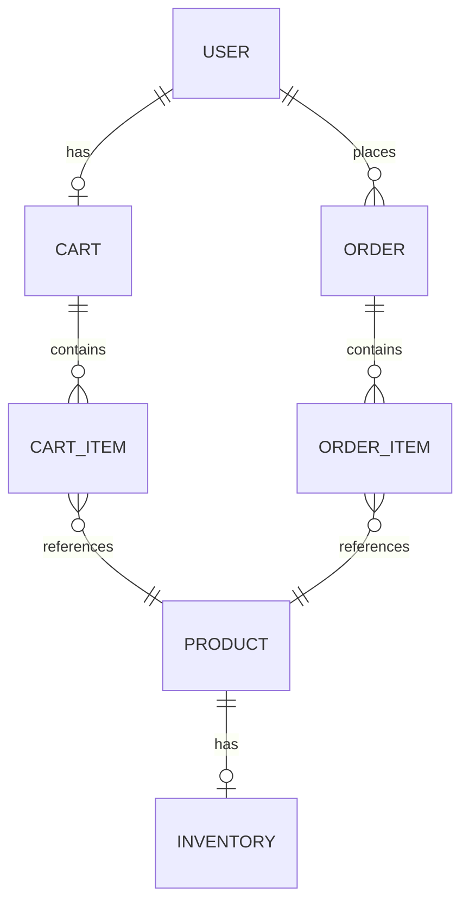
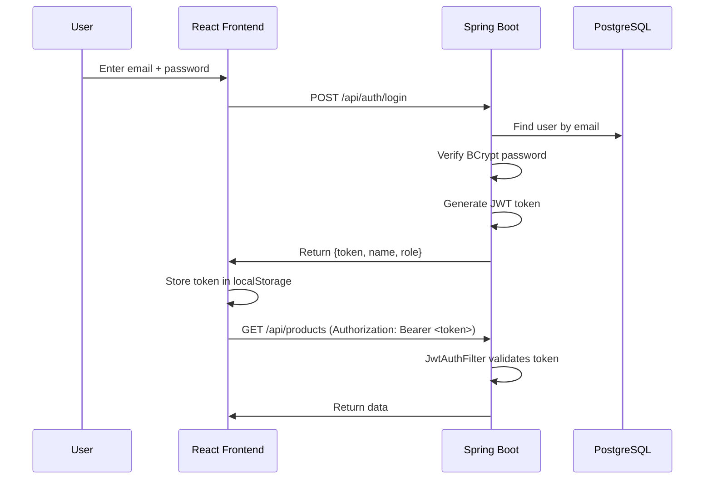
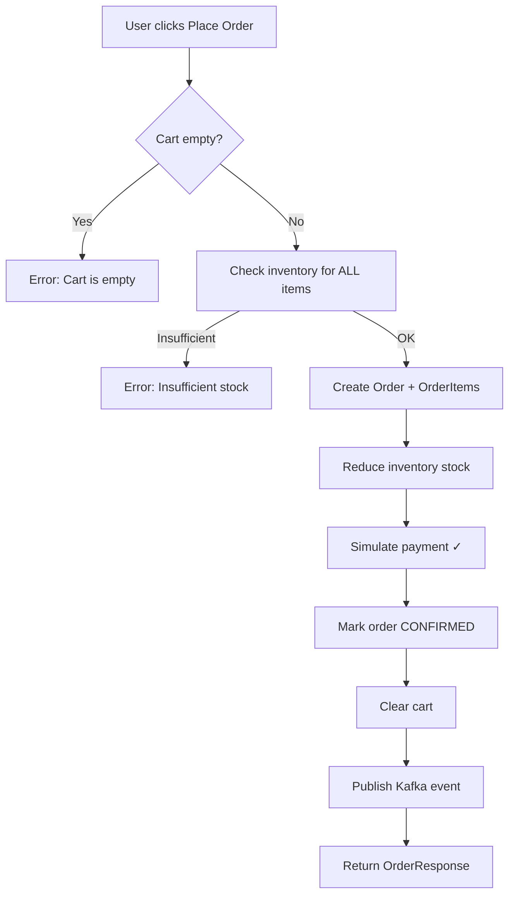

# Enterprise E-Commerce & Order Management Platform

A full-stack e-commerce application built for **campus placement interview mastery**. Covers Java 21, Spring Boot 3.x, Spring Security + JWT, JPA/Hibernate, PostgreSQL, Redis, Kafka, React + Vite, Docker, and testing — all in a clean, modular monolith.

## ✨ Features

| Feature | Tech |
|---------|------|
| User Registration & Login | Spring Security + BCrypt + JWT |
| Product Catalog (CRUD) | Spring Data JPA + PostgreSQL |
| Search, Filter, Pagination | Spring Data Pageable + JPQL |
| Shopping Cart | JPA + Redis caching |
| Order Management | @Transactional + Inventory checks |
| Async Order Events | Apache Kafka (Producer/Consumer) |
| Role-Based Access Control | Spring Security + @PreAuthorize |
| Admin Dashboard | React + Protected Routes |
| API Documentation | Swagger / OpenAPI 3 |
| Containerized Deployment | Docker + Docker Compose |
| Unit & Integration Tests | JUnit 5 + Mockito + MockMvc |

## 🏗 Architecture



## 🛠 Tech Stack

| Layer | Technology | Why |
|-------|-----------|-----|
| Language | Java 21 | Latest LTS, virtual threads support |
| Framework | Spring Boot 3.3.5 | Industry standard, auto-configuration |
| Security | Spring Security + JWT | Stateless auth for REST APIs |
| ORM | JPA / Hibernate | Object-relational mapping, DB abstraction |
| Database | PostgreSQL 16 | ACID transactions, relational data |
| Cache | Redis 7 | Sub-ms reads for cart/product caching |
| Messaging | Apache Kafka | Async event-driven order notifications |
| Frontend | React 18 + Vite | Component-based SPA, fast HMR |
| HTTP Client | Axios | Promise-based, interceptors for JWT |
| Docs | SpringDoc OpenAPI | Auto-generated Swagger UI |
| Testing | JUnit 5 + Mockito | Unit + integration testing |
| Containers | Docker + Docker Compose | One-command deployment |

## 📊 Database Design



**7 Tables:** `users`, `products`, `inventory`, `carts`, `cart_items`, `orders`, `order_items`

## 🔐 Authentication Flow



## 🛒 Order Flow



## 📦 Redis Usage

- **What:** Product listing and cart data caching
- **Why:** Carts are read on every page load → high read frequency. Redis provides sub-ms reads vs PostgreSQL's ~5-10ms
- **How:** Spring `@Cacheable`, `@CacheEvict` annotations
- **Fallback:** If Redis is down, app falls back to PostgreSQL (graceful degradation)

## 📨 Kafka Usage

- **Topic:** `order-events`
- **Producer:** Publishes event after successful order creation
- **Consumer:** Logs notification (simulates email/SMS)
- **Why:** Decouples order processing from notification logic
- **Failure:** If Kafka is down, order still succeeds (Kafka publish is in try-catch)

## 🚀 How to Run

### Prerequisites
- Java 21
- Node.js 18+
- Docker & Docker Compose
- Maven (or use included wrapper)

### Option 1: Docker Compose (Recommended)
```bash
docker compose up --build
```
- Frontend: http://localhost:3000
- Backend: http://localhost:8080
- Swagger: http://localhost:8080/swagger-ui.html

### Option 2: Local Development
```bash
# Start infrastructure
docker compose up postgres redis kafka -d

# Backend
cd backend
./mvnw spring-boot:run

# Frontend (new terminal)
cd frontend
npm install
npm run dev
```

## 🔑 Sample Credentials

| Role | Email | Password |
|------|-------|----------|
| Admin | admin@ecommerce.com | admin123 |
| User | user@ecommerce.com | user123 |

## 🧪 Running Tests
```bash
cd backend
./mvnw test
```

## 📁 Project Structure

```
├── backend/
│   ├── src/main/java/com/ecommerce/
│   │   ├── controller/     # REST API endpoints
│   │   ├── service/        # Business logic
│   │   ├── repository/     # Data access (JPA)
│   │   ├── entity/         # Database entities
│   │   ├── dto/            # Request/response objects
│   │   ├── security/       # JWT + Spring Security
│   │   ├── config/         # Redis, Kafka, Swagger config
│   │   ├── exception/      # Global error handling
│   │   ├── mapper/         # Entity ↔ DTO mapping
│   │   └── kafka/          # Producer + Consumer
│   └── src/test/           # Unit + integration tests
├── frontend/
│   ├── src/
│   │   ├── pages/          # React page components
│   │   ├── components/     # Reusable components
│   │   ├── context/        # Auth state management
│   │   └── api/            # Axios configuration
│   └── Dockerfile
├── docker-compose.yml
├── docs/                   # Documentation
└── .env.example
```

## 🔮 Future Improvements
- Real payment gateway (Razorpay/Stripe)
- Email notifications via Kafka consumer
- Product image uploads (AWS S3)
- Search with Elasticsearch
- WebSocket for real-time order tracking
- Kubernetes deployment
- CI/CD with GitHub Actions
- Rate limiting
- Refresh tokens

## 📚 Documentation
- [Architecture](docs/ARCHITECTURE.md)
- [API Reference](docs/API.md)
- [Interview Guide](docs/INTERVIEW_GUIDE.md)
- [Interview Questions (100+)](docs/INTERVIEW_QUESTIONS.md)
- [Learning Roadmap](docs/LEARNING_ROADMAP.md)
- [My Contribution](docs/MY_CONTRIBUTION.md)
- [Troubleshooting](docs/TROUBLESHOOTING.md)
