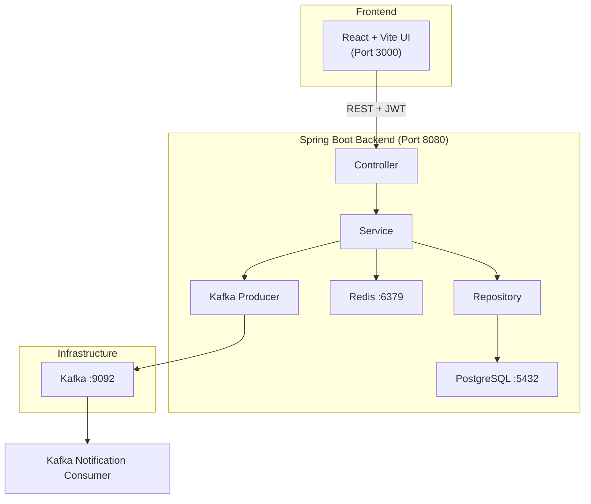
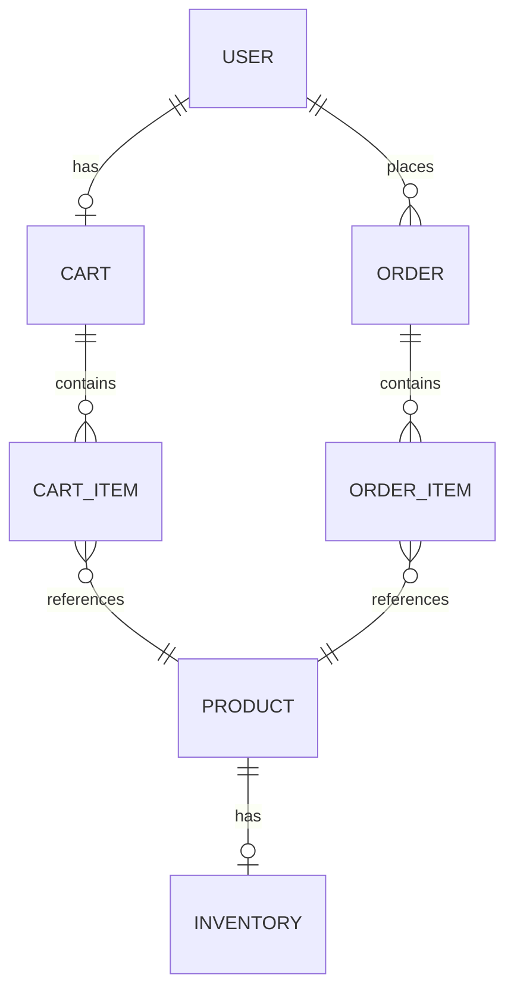

# Enterprise E-Commerce & Order Management Platform

A robust, full-stack e-commerce solution designed with a modern microservices-inspired architecture running on a modular monolith. Built to handle end-to-end retail operations—from product browsing and cart management to secure checkout and asynchronous order processing. 

This platform showcases enterprise-grade patterns using Java 21, Spring Boot 3, and React, backed by a high-performance infrastructure stack including PostgreSQL, Redis caching, and Apache Kafka.

## ✨ Core Capabilities

| Feature | Implementation |
|---------|------|
| **Secure Authentication** | Stateless JWT-based auth via Spring Security and BCrypt password hashing. |
| **Catalog Management** | Spring Data JPA over PostgreSQL with robust pagination and filtering. |
| **High-Speed Caching** | Sub-millisecond cart and product retrieval powered by Redis 7. |
| **Transactional Orders** | ACID-compliant order placement with strict inventory checks and rollbacks. |
| **Event-Driven Messaging** | Asynchronous post-order notifications handled by Apache Kafka. |
| **Admin Operations** | Dedicated React dashboard protected by Role-Based Access Control (RBAC). |
| **Containerized Deployment**| One-click local environment spin-up via Docker and Docker Compose. |
| **Comprehensive Testing** | Extensive coverage using JUnit 5, Mockito, and MockMvc. |

## 🏗 System Architecture

The application follows a clean, layered architecture separating controllers, business logic, data access, and infrastructure constraints.



## 🛠 Technology Stack

- **Backend:** Java 21, Spring Boot 3.3.5, Spring Security, Spring Data JPA
- **Frontend:** React 18, Vite, Axios, Custom CSS
- **Database:** PostgreSQL 16
- **Caching Layer:** Redis 7
- **Message Broker:** Apache Kafka 3.7.0 (KRaft mode)
- **Tooling:** Docker, Maven, SpringDoc OpenAPI (Swagger)

## 📊 Database Schema



## 🚀 Getting Started

The entire stack is containerized for a seamless developer experience. You do not need to install Java, Node, or databases locally—just Docker.

### 1. Launch the Platform
```bash
docker compose up --build -d
```

### 2. Access the Services
- **Web App:** http://localhost:3000
- **API Backend:** http://localhost:8080/api
- **Swagger Documentation:** http://localhost:8080/swagger-ui/index.html

### 3. Test Credentials
| Role | Email | Password |
|------|-------|----------|
| Admin | admin@ecommerce.com | admin123 |
| Customer | user@ecommerce.com | user123 |

## 📦 Engineering Decisions

### Redis for Caching
E-commerce platforms are heavily read-optimized. The product catalog and user shopping carts are aggressively cached in Redis. This reduces PostgreSQL load significantly and drops latency for product retrieval from ~10ms down to sub-millisecond speeds. If Redis experiences downtime, the system automatically degrades gracefully and routes queries back to PostgreSQL.

### Kafka for Event-Driven Processing
Order placement is a critical synchronous path. However, post-order actions like sending confirmation emails, updating analytics, or notifying shipping partners don't need to block the user's checkout experience. We use Apache Kafka to publish an `order-events` message upon transaction commit, allowing independent consumers to handle these operations asynchronously.

## 🧪 Development & Testing

To run the application locally outside of Docker (useful for debugging):

```bash
# 1. Spin up only the backing services
docker compose up postgres redis kafka -d

# 2. Run the Spring Boot API
cd backend
./mvnw spring-boot:run

# 3. Run the React frontend
cd frontend
npm install
npm run dev
```

To execute the test suite:
```bash
cd backend
./mvnw test
```

## 🔮 Future Roadmap
- Integration with a real payment gateway (e.g., Stripe/Razorpay)
- Full-text search implementation using Elasticsearch
- CI/CD pipelines via GitHub Actions
- Migration to Kubernetes for orchestration
