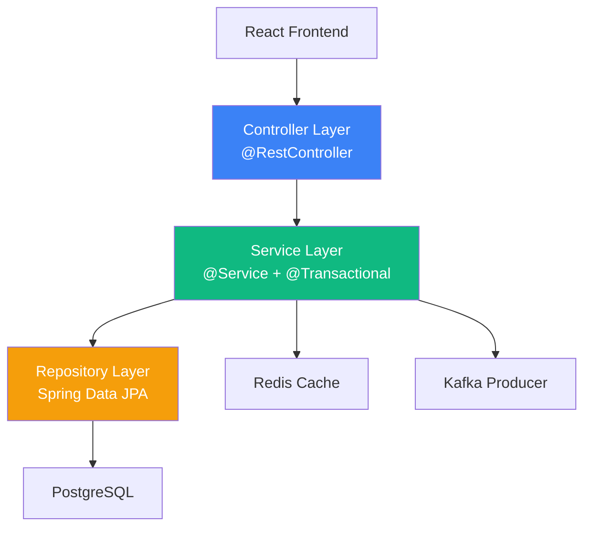
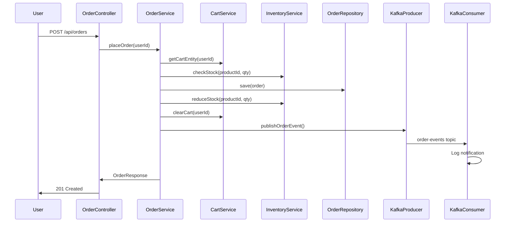
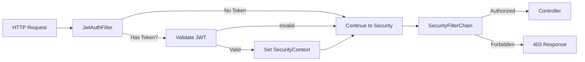

# Architecture Document

## Overview

This application follows a **modular monolith** architecture — a single deployable unit with clear internal module boundaries.

### Why Modular Monolith?

| Decision | Detail |
|----------|--------|
| **WHAT** | Single Spring Boot application with layered package structure |
| **WHY** | Simpler to develop, deploy, debug, and explain in interviews |
| **ALTERNATIVE** | Microservices (separate services for Product, Order, Cart, etc.) |
| **TRADE-OFF** | Monolith is less scalable but far simpler; can be split later |

## Layered Architecture

### Layer Responsibilities

| Layer | Responsibility | Spring Annotations |
|-------|---------------|-------------------|
| **Controller** | HTTP request/response handling, validation | `@RestController`, `@Valid` |
| **Service** | Business logic, transactions, caching | `@Service`, `@Transactional`, `@Cacheable` |
| **Repository** | Data access, queries | `@Repository`, `JpaRepository` |
| **Entity** | Database table mapping | `@Entity`, `@Table` |
| **DTO** | API request/response shapes | `@Data`, validation annotations |
| **Security** | Authentication, authorization | `@Configuration`, `OncePerRequestFilter` |

## Data Flow: Order Placement

## Security Architecture

## Technology Decisions

### PostgreSQL vs MongoDB
| | PostgreSQL | MongoDB |
|---|-----------|---------|
| Schema | Fixed schema, strong relationships | Flexible schema |
| Transactions | Full ACID | Limited multi-doc transactions |
| Our data | Highly relational (users → orders → items) | Would need denormalization |
| **Decision** | ✅ PostgreSQL — relational data needs relational DB |

### Redis vs In-Process Cache (Caffeine)
| | Redis | Caffeine |
|---|-------|---------|
| Location | External server | JVM heap |
| Shared | Yes (multi-instance) | No |
| Persistence | Optional | No |
| **Decision** | ✅ Redis — demonstrable, interview-relevant, production-realistic |

### Kafka vs REST Calls for Notifications
| | Kafka | REST |
|---|-------|------|
| Coupling | Loose (producer doesn't know consumers) | Tight (direct HTTP call) |
| Reliability | Messages persisted in topic | Lost if service is down |
| Scalability | Add consumers without changing producer | Each consumer needs integration |
| **Decision** | ✅ Kafka — demonstrates async, event-driven architecture |

### JWT vs Session-Based Auth
| | JWT | Sessions |
|---|-----|---------|
| State | Stateless (token contains claims) | Stateful (server stores session) |
| Scalability | Easy (no shared session store) | Needs sticky sessions or shared store |
| Revocation | Difficult (no built-in revoke) | Easy (delete from store) |
| **Decision** | ✅ JWT — standard for REST APIs, interview-relevant |
